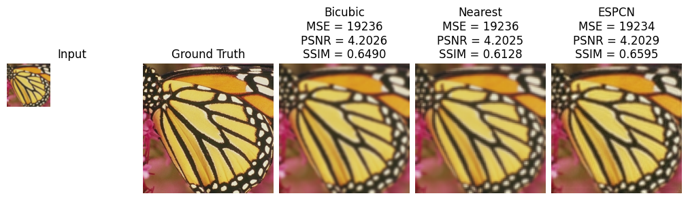

Results
=======

We then apply the model to *Set5* with their performances shown 

.. list-table:: Performances on Set5

   * - Method
     - PSNR (dB)
     - SSIM
     - MSE
   * - Nearest
     -
     -
     -

